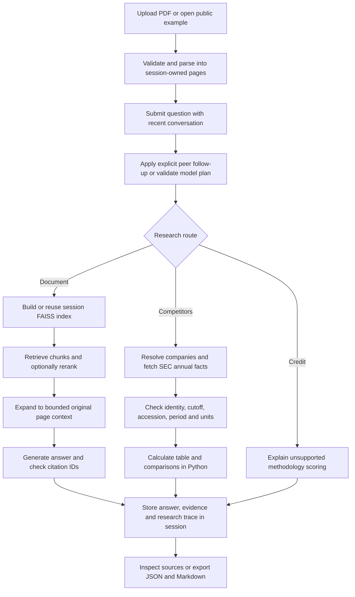

# Developer and operator guide

This guide describes the implementation at `6a7372e`. Start with the
[README](README.md) for installation and usage. Consult the
[validation record](VALIDATION.md) and [benchmark results](benchmarks/RESULTS.md)
for what has actually been exercised. FinRead is currently a local application;
a hosted, authenticated multi-user service is not implemented.

## Request flow and ownership



`app.py` owns submissions and session presentation. `research_answer` in
`intelligence.py` owns routing and orchestration. It receives a retriever factory,
so the competitor and credit paths do not build a PDF index. The document route
passes the factory's retriever through `finread.PageContextRetriever` before
answer generation. Do not move embedding construction ahead of routing.

`finread.ensure_index` keys an index by document hash/name, embedding model,
Ollama endpoint and chunk settings. `services.build_index` splits pages and embeds
at most 16 chunks per request. It creates the FAISS index only after all batches
succeed. A failed or incomplete batch must not publish a partially built index.

Ranking works on chunks. The context wrapper then recovers full pages from the
same session using **both source name and page number**. It deduplicates expanded
pages and respects the context limits below. Oversized pages retain the ranked
excerpts; this is not table reconstruction or OCR.

## Configuration and limits

| Setting | Default / behavior |
| --- | --- |
| `OLLAMA_BASE` | `http://localhost:11434`; set before starting the app |
| Analysis model | `llama3`; UI alternatives include `mistral` and `gemma2` |
| Embedding model | `mxbai-embed-large`; UI alternative `nomic-embed-text` |
| Reranker | Enabled, `cross-encoder/ms-marco-MiniLM-L-6-v2` |
| UI retrieval settings | 15 candidates and 4 evidence excerpts by default |
| Model benchmark settings | 8 candidates and 4 excerpts; this differs from the UI default |
| Generation | Temperature 0, context setting 8,192, output setting 1,024 tokens |
| Model HTTP timeouts | Embeddings 120 seconds; generation 180 seconds per call |
| Upload | 25 MiB maximum, 1,000 pages maximum; readable text required |
| Chunking | 1,000 characters with 150-character overlap |
| Embedding batch | At most 16 chunks |
| Page context | At most 6,000 characters per expanded page and 18,000 total |
| Chat submission | At most 4,000 characters in the UI |
| SEC research | Focal company plus at most three peers; 16 requests and a 75-second budget by default |
| SEC pacing | At least 0.25 seconds between request starts within one process |
| SEC response / cache | 25 MiB maximum response; up to 12 public responses, one-hour TTL |
| SEC retry | At most two attempts per endpoint; bounded transient-status retry and shared `Retry-After` cooldown |
| Readiness probe | Up to five companies, 24 requests and a 150-second budget; no cache reads |
| Entity extraction | At most five selected pages in the UI |

Time budgets and HTTP timeouts do not constitute a durable job scheduler or a
hard end-to-end cancellation mechanism. SEC pacing/cooldowns are process-wide,
not coordinated across multiple server processes. Alternative models and clean
installs of every unpinned dependency have not been validated.

`SEC_USER_AGENT` takes precedence over the optional `.sec-user-agent` file beside
`sec_data.py`. The file contains one application/contact line and should have
permissions 600. Both Git and Docker ignore it. A constructor-supplied identity
also overrides defaults for callers of `SecClient`. Containers must receive the
environment variable; the local identity file is not copied into the image.
Never put an actual operator contact into example configuration or committed logs.

The model benchmark additionally reads `FINREAD_MODEL` (default `llama3`). This
variable does not change the app's UI-selected model. Benchmark runs disable
Hugging Face downloads and require cached reranker weights; normal app startup
may download reranker weights on first use. The application does not load `.env`
files itself. Export variables in the launching environment.

## SEC selection and fallback contract

Only the fixed SEC ticker, submissions and Company Facts endpoints are allowed.
TLS verification stays enabled and redirects are rejected. The adapter resolves
company identity, excludes financial-company SIC codes 6000–6999, and selects an
original 10-K available by the requested cutoff. It checks the Company Facts CIK
against the requested company. Historical lookup examines at most three listed
submission archives when needed.

Supported values are consolidated annual USD revenue, operating income and
operating cash flow. Operating margin is calculated from income and positive
revenue for matching periods/units. Facts must match the selected original
accession and report end, with an annual duration of 330–380 days. Missing,
nonfinite or conflicting values are not replaced with zero. Inconsistent starts
across selected metrics reject the result. An available amendment produces a
warning; its figures are not silently substituted. Without an explicit year, an
annual report end more than 550 days before the cutoff is rejected as stale.

The example defaults to 2025-10-31. Other uploads default to the current date,
because their publication date is not reliably inferred. Fiscal years in the
external tool refer to the calendar year of the period end. Different companies'
fiscal windows are displayed and flagged; they are not calendar-normalized.

`SecTransportError` represents a transport limitation that may permit fallback.
A semantic `ResearchError`, such as unresolved identity or HTTP 404, does not.
The production fallback supports only the exact 2025-10-31 cutoff, the three
bundled companies and their matching fiscal years. See
[peer source provenance](assets/filings/PEER_SOURCES.md). The five-company
benchmark fixtures are evaluation inputs, not an expanded production fallback.

## Evidence, exports and session lifecycle

| Contract | Contents / guarantee |
| --- | --- |
| `ResearchPlan` | Route, focal company, peers, cutoff, optional fiscal year, standalone query, clarification and identity mentions |
| `AnnualFinancials` | Company/CIK/ticker, start/end/filed dates, accession, source URL, cutoff, facts, warnings, retrieval timestamp, origin and currency |
| `Answer` | Answer text, source list, warnings, search query and research metadata |
| Document source | Source ID, filename, one-based PDF page, printed page label when available, and actual excerpt/page text |
| Company source | Source ID, `kind=financials`, original report URL and structured financials; no uploaded-PDF page reference |
| Research metadata | Validated plan, status, peer basis, tool trace, deterministic comparisons, data origin summary and request events when available |
| Export | Document name/hash plus answer history in JSON; readable notes include evidence and limitations |

Research statuses include `complete`, `partial`, `needs_clarification` and
`unsupported`. `complete` describes workflow completion, not verified financial
truth. Peer `data_status` distinguishes `live_sec`, `snapshot`, `mixed` and
`unavailable`. A `live_sec` record can originate from the normal public cache;
request events distinguish `cache_hit` from `network_ok`. The readiness and live
benchmark commands explicitly disable cache reads.

Citation IDs are local to an answer. Source selection therefore carries both the
answer index and source ID. Do not interpret `S1` as a globally unique source.
A recognized citation ID is not a check that the cited text entails the claim.

Uploads are parsed in memory. Parsed pages, FAISS indexes, chat, entity results
and source selection belong to the Streamlit session. Replacing/removing a
source resets its derived state. Starting a new conversation clears chat and
selection while retaining the index. Browser refreshes or process restarts may
lose research; exports are the current persistence mechanism.

The configured Ollama server receives document text. Only public-company lookup
and financial-data requests go to SEC. Public SEC JSON, immutable example bytes
and model resources can be shared caches; private document indexes are not.
Exports can contain uploaded source text and should be handled accordingly.
There is no durable tenant store, retention service or access-control layer yet.

## Local operations and recovery

For an existing configured environment:

```bash
python -m streamlit run app.py --server.address=127.0.0.1 --server.port=8502 --server.fileWatcherType=poll
```

Run from the repository root and use the environment containing the requirements.
The port is optional; Streamlit and Compose otherwise use 8501. Stop the specific
foreground development process with Ctrl-C before restarting it. Imported-module
interface changes have previously left a retained preview stale. Restart that
process and verify the actual browser, not just the health endpoint. Export any
research you need before restarting.

| Symptom | Investigation and recovery |
| --- | --- |
| SEC 403 | Check operator identity configuration, then run `scripts/check_sec.py`. A correct identity resolved the observed development failure, but does not guarantee access on every network. Do not spoof a browser or disable TLS. |
| SEC 429 / cooldown | Honor the displayed cooldown. The client stops if the wait exceeds its remaining budget; reduce company count or retry later. |
| Missing company, metric or year | Inspect the original filing, requested cutoff and supported scope. Do not use a snapshot to conceal a semantic failure. |
| Answer marked snapshot | Check the explicit origin and historical cutoff. Use the live-only probe to assess connectivity. |
| Ollama unavailable / missing model | Check the configured endpoint and `ollama list`; select an installed model. Models must be installed separately. |
| Embedding runner connection reset | Preserve existing research. Stop the failed evaluation/request, inspect the local Ollama process, and restart/unload the affected model if needed. The observed runner recovered after unloading; bounded batches reduce request size but do not prove concurrency readiness. |
| Reranker weights unavailable | The normal app can download weights, or disable reranking in Settings. The offline-model benchmark requires cached weights. |
| Encrypted, scanned or invalid PDF | Use an unlocked text PDF or run OCR externally. Partial textless pages are reported in the UI. |
| Plausible answer with incorrect amount | Inspect the actual source row and unit. A known generated capex answer is wrong by a factor of 1,000; valid citations do not make it safe. |
| Local model benchmark exits 1 | Inspect per-case checks. The documented 43/44 result includes a real unit error; do not change labels or tolerances merely to make it green. |

Compose binds host port 8501 to loopback and points to the host's Ollama using
`host.docker.internal`. The image runs as a non-root user and has an HTTP health
check. Configuration has been checked, but a new image build, multi-user load,
backup recovery and hosted deployment have not been verified. The legacy tracked
`uploaded.pdf` is unused by the app and excluded from image builds; review its
history separately before a public release.

## Verification and safe extension points

Use the [benchmark guide](benchmarks/README.md) for exact commands, modes,
provenance and source-label review. Run offline tests and the replay benchmark for
changes to arithmetic, routing validation, source contracts, session lifecycle or
SEC handling. Run a relevant real-model subset for changes to prompts/retrieval;
run a live SEC check for network behavior. UI changes need browser interaction
verification as well as AppTest. Do not describe mock or replay results as live.

When adding a metric, define its accounting scope, tags, units, formula, invalid
inputs and period constraints before exposing it. Update source evidence, the
comparison table, exports, golden cases and missing/conflicting-data tests
together. When adding a data source, preserve explicit provenance and transport
vs semantic error handling. New peer discovery must provide a defensible business
rationale; ticker similarity or model recollection is insufficient.

Methodology scoring remains a separate future capability. Follow
[the credit design](INTELLIGENCE.md#methodology-led-credit-analysis) and the
[roadmap](ROADMAP.md); a retrieved S&P passage alone does not implement a rating.
